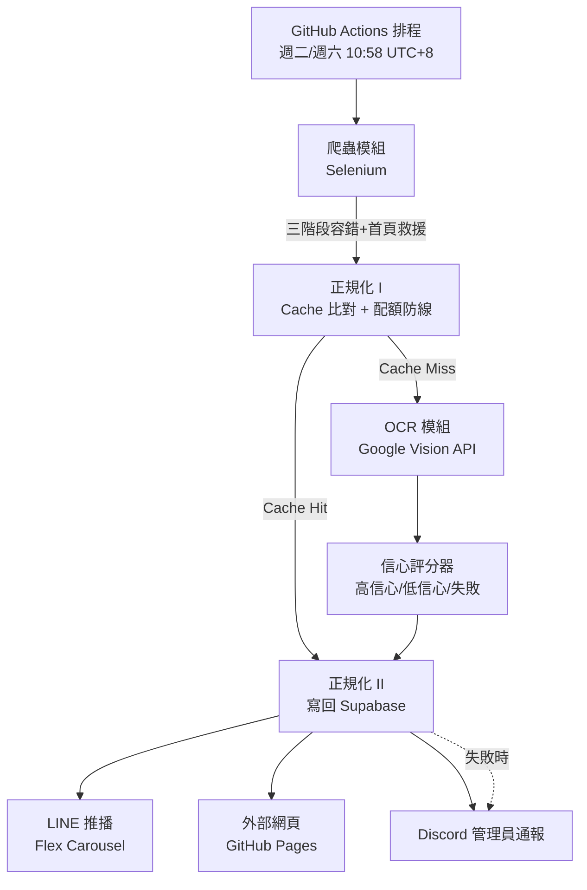

# 好市多優惠情報 Agent：零成本、無人值守的自主化資訊管線

**一句話定位**：一套從網頁爬取、AI 視覺辨識、信心分級決策，到多管道通知的全自動化 Agent，每週二、六準時執行，全程無人值守，月成本 $0。

---

## 系統架構

**技術棧**：Selenium（爬蟲）、Google Vision API（OCR）、PostgreSQL / Supabase（資料庫 + REST API）、GitHub Actions（排程與部署）、LINE Messaging API（使用者通知）、Discord Webhook（維運通報）、GitHub Pages（靜態前端）。

---

## 案例研究

### 案例一：用信心分級取代「追求完美演算法」，處理 OCR 的不確定性

**挑戰**
價格牌 OCR 辨識在小規模測試時準確率達 94%，但擴大到大量批樣測試後驟降到 81.7%——這是典型的過擬合訊號：先前的參數調整只是記住了測試集的特徵，換一批沒看過的商品牌就失效。同時，Tesseract 引擎對數字的辨識率也卡在 70-80% 的天花板，無法再靠調參突破。

**解法**
與其繼續在演算法層面死磕準確率，改把問題定義成「系統要對自己的判斷有多少把握」：
- 換掉 Tesseract、改用 Google Vision API 處理文字辨識本身
- 用「原價 － 折扣 = 特價」做數學交叉驗證，而不是單純信任辨識出來的數字
- 建立三層信心分級：高信心（直接呈現價格）、低信心（退回原圖讓人工確認）、辨識失敗（同樣退回原圖）
- 對照爬蟲抓到的網頁文字做交叉比對，用字元重疊數而非要求完全命中，降低對中文辨識雜質的敏感度

**成果**
整體文字辨識率達 96.7%，其中系統有把握直接呈現價格的比例落在 70-76%。刻意不追求「每筆都自動判定」，而是讓系統誠實地表達不確定性——這正是機器學習系統設計中「校準（calibration）」的實務體現：一個知道自己什麼時候不該自信的系統，比一個盲目自信的系統更值得信任。

---

### 案例二：查證第三方 API 的真實限制，而非憑印象開發

**挑戰**
LINE Messaging API 免費方案每月 200 則訊息，原始設計假設是「1 個 Flex Carousel 算 1 次額度」，並據此規劃「固定 4 輪推播」的分卡邏輯。

**解法**
在正式寫程式碼前，回頭查證 LINE 官方文件，發現額度的計算方式其實是「以收訊人數計算，一次請求包含幾個訊息物件不影響額度消耗」——也就是說額度消耗＝API 呼叫次數 × 收訊人數，跟塞了幾張 Carousel 卡片無關。這個認知落差如果沒抓到，會導致：
- 好友數增加時，額度消耗會被系統性低估
- 原本「固定輪數」的設計思路整個沒有意義，應該改成「盡量壓進單一次 API 呼叫」

於是重新設計：把總覽卡、高信心精選、低信心圖卡動態分配進最少數量的 Carousel，盡量壓進 LINE 單次 API 呼叫最多 5 個訊息物件的上限（同時也順手查證並修正了「Carousel 最多 10 張卡片」的過時假設，官方規格其實已提升至 12 張）。

**成果**
在 5 人以內的好友規模下，正常執行單次 API 呼叫即可打完，一個月約消耗 40/200 額度，即使遇到極端情況需要二次呼叫，也還在 80/200 的安全範圍——比原始「固定 4 輪」的設計省下大量非必要的額度消耗。

---

### 案例三：無人值守系統的韌性設計——三層容錯與失敗告警

**挑戰**
系統排程每週自動執行兩次，沒有人在旁邊盯著。爬蟲依賴的目標網站清單頁一旦改版、當機、或被廣告干擾導致 DOM 結構異動，程式會直接抓不到資料而整批失敗；而更根本的問題是，早期版本即使 pipeline 中途拋出例外，資料庫裡對應的執行紀錄也不會被正確標記，只會卡在「執行中」狀態，事後完全無法回溯當時發生了什麼。

**解法**
- **爬蟲三階段容錯**：第一階段用關鍵字直接掃描頁面連結（抗版型變動）；第二階段退回結構化的 post-ID 搜尋並加入內容過濾；第三階段在清單頁整個無法使用時，改跳轉回首頁用同一套關鍵字邏輯救援
- **執行狀態機**：資料庫新增 `runs` 表追蹤每次執行的完整生命週期（`running` → `success` / `failed`），pipeline 用 `try/except` 包住核心流程，例外發生時標記失敗狀態並寫入錯誤訊息，再重新拋出例外，確保 GitHub Actions 依然會正確標記失敗並觸發內建的失敗通知
- **雙重告警通道**：Discord Webhook 每次執行都推送結構化報告（含配額用量、分級統計、待複核清單），失敗時額外推送紅色警告訊息，跟面向使用者的 LINE 推播完全分離

**成果**
系統從「跑錯了才知道跑錯了」，進化到「跑錯了會主動告訴你為什麼錯」。爬蟲的多層救援機制也在真實情境中驗證過——目標網站清單頁曾經因改版與短暫當機各自觸發過一次容錯機制，系統都成功繞過並完成當次執行。

---

### 案例四：關注點分離的模組化架構——正規化 I / II 拆分

**挑戰**
資料要在「判斷是否需要花錢呼叫 OCR API」跟「把結果寫回資料庫」這兩件事之間找到清楚的責任邊界，否則成本控制邏輯（Cache 比對、月配額防線）跟資料寫入邏輯（分級判定、四張表同步）會糾纏在一起，難以獨立測試或修改。

**解法**
拆成兩個職責單一的模組：
- **正規化 I**：只負責「這個商品需不需要送 OCR」——查快取、查本月已用配額、決定是否跳過
- **正規化 II**：只負責「OCR 結果出來之後怎麼辦」——分級判定、寫回 Supabase 四張表、統計本次執行摘要

兩者透過純函式介面（輸入輸出都是 Python 資料結構，不碰檔案 I/O）串接，讓整條管線可以在記憶體中一次跑完，不需要像最初的地端版本一樣，每個階段都要手動產出 CSV 再餵給下一階段。

**成果**
四支獨立腳本最終合併成單一 `main.py` orchestrator，可以在本機、也可以在 GitHub Actions 上以完全相同的程式碼路徑執行；後續要新增 LINE 推播、Discord 通報等功能時，都只是在既有的資料結構末端多接一段，沒有動到核心的判斷邏輯。

---

## 量化成果

| 指標 | 數據 |
|---|---|
| OCR 文字辨識率 | 96.7% |
| 信心評分通過率（可直接呈現價格） | 70–76% |
| 月執行成本 | $0（Google Vision 免費額度內、Supabase 免費方案、GitHub Actions 免費額度、LINE / Discord 免費方案） |
| Vision API 月用量 | 約 400–900 次（上限 950，含安全緩衝） |
| LINE 推播月消耗 | 約 40 / 200 則額度 |
| 排程準確度 | 每週二、六台北時間 10:58 自動觸發，零人工介入 |

---

## 附錄：完整開發歷程（Changelog）

> 原始逐版本除錯紀錄，保留作為工程紀律與版本追蹤習慣的佐證。

**V1** 爬蟲模組（清單部分）

**V2** [Bug] 模擬滑鼠滾動時目標網頁 JS 直接跳頁
1. 改用 `ActionChains.scroll_by_amount()`
2. 滾動幅度與間隔改用亂數
3. 加入換頁偵測

**V3** 爬蟲模組（文章部分）

**V3.1** [Bug] 部分圖片因中間插入廣告導致元素異動
1. 從直接抓取清單內所有圖片網址，改為限定標籤爬取

**V3.2** [Bug] 同一張圖片共用多行文字
1. 將原相對數量紀錄，使用聯集改為順序狀態結構

**V4** 爬蟲模組組合

**V5** 導入 log 紀錄

**V6** 導入時間排程

**V6.1** [Bug] 網站更新後清單定位不到主容器
1. 新增全頁檢查機制
2. 除錯機制改為三層結構

**V7** [Bug] 爬取到的文字包含商品名稱、商品大小（複數）、產品代號（複數）混雜
1. 導入正規化
2. 將中文、代號定位
3. 採用變體拆解（品項、大小）

**V8** OCR 模組－單圖測試　[Bug] 圖片雜質過多
1. 導入輪廓偵測
2. 以框出整塊牌子為基準
3. 幾何特徵與長寬比篩選機制（輪廓面積＋外接矩形面積）

**V8.1** OCR－單圖測試　[Bug] 單一圖片有複數商品牌，導致幾何特徵完全失效
1. OCR 全圖
2. 商品編號當錨點分組
3. 導入座標距離分組演算法
4. 導入欄位角色分類規則
（文字辨識無法辨識，數字僅 70–80%）

**V8.2** OCR－單圖測試　[Bug] Tesseract 引擎極限
1. 導入 Google Vision API
2. ［測試］導入批樣測試避免過擬合
3. 特定字串排除
（除原價識別外皆辨識成功；礙於成本考量暫放棄原價獨立識別）

**V8.3** OCR－少量批樣測試　[Bug] 次要目標中文辨識雜質過多，需迭代修正
1. 防範過擬合，將離群值標註
2. 僅當參考數據，不要求命中率
3. 對比爬蟲文字資料，3 個字元重疊即算符合

**V8.4** OCR－大量批樣測試　[Bug] 演算法極限：過擬合（94.1% → 81.7%）
1. 採信心評分機制
2. 信心評分基準：高信心／低信心／OCR 失敗
3. 辨識率 96.7%，信心評分通過率 70–76.0%

**V8.41** [Bug] 目標清單網址當機，導致無法定位
1. 轉跳回首頁，用關鍵字定位

**V8.42** [Bug] 目標清單網址出現非優惠消息文章
1. 第一、二階段容器內雙重偵測加入關鍵字定位，並優化合併為第一階段

**V9** 訊息可視化（正規化）、引入 Supabase 資料庫
1. 建立正規化 I、II
2. 正規化 I 專職資料清洗與成本控制
3. 正規化 II 專職規格化資料寫入資料庫、風險三等級分流、推播資料輸出
4. 建立 Supabase 資料庫，達成資料流串聯目標

**V10** 分階段部署測試
1. V1：爬蟲
2. V2：正規化 I、II、OCR
3. V3：LINE 串接
4. V4：Discord 管理員通報

**V11** LINE 串接、傳送設計
1. 免費額度問題：推播方式若沒設計會導致超標
2. 採用 Flex Message
3. 商品全覽卡改用外部網頁，以靜態頁面（GitHub Pages）呈現

**V11.1** [Bug] 管理員通報管道用 LINE，衍生 Webhook 設定複雜度問題
1. 管理員通報改用 Discord

**V11.2** [Bug] 部分執行紀錄未寫進資料庫
1. 錯誤報告（圖片處理失敗清單）與失敗狀態標記，正式導入主流程

**V12.0** Discord 管理員通報正式上線
